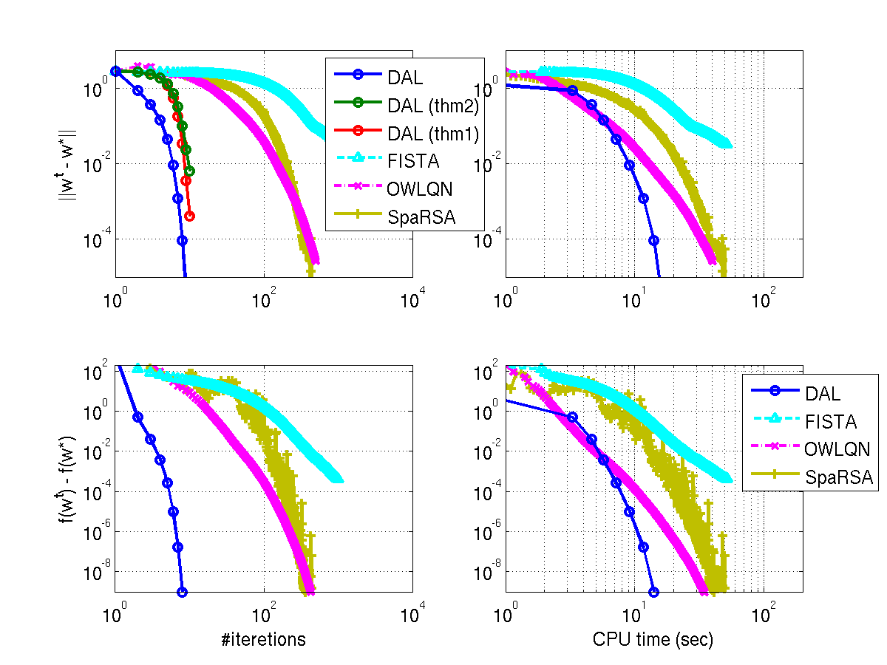

# Support Page for "Super-Linear Convergence of Dual Augmented Lagrangian Algorithm for Sparse Learning"

This page is set up to make it easy for people to reproduce the results I presented in the above mentioned paper I presented in a [workshop](http://opt.kyb.tuebingen.mpg.de/) at NIPS 2009. Below you can download my implementation of L1-regularized logistic regression solvers based on FISTA (Beck & Teboulle, 09), OWLQN (Andrew & Gao, 07), SpaRSA (Wright et al., 09), as well as the proposed [DAL](https://github.com/ryotat/dal/) algorithm.

## Instructions
 1. Download the package.
 1. Also download DAL ver 1.01 (or older) from [here](https://github.com/ryotat/dal). 
 1. Supposing that the above scripts are extracted in `somewhere/opt09` and the DAL scripts are extracted in `somewhere/dal/` (if not change the first line in `s_opt09.m`), open MATLAB and type:
```matlab
 s_opt09
```

Note that by default the number of repetitions is one (no average). You can increase this number by modifying the following line in `s_opt09.m`
```matlab
6: nrep=1;
```
to 10 for example.

## Results
 You should get a picture like this:
 

 In the above figure, the convergence of four algorithms is compared in terms of the Euclidian norm ||w-w*|| (w* is the true minimizer) and the function value residual f(w)-f(w*) against number of steps (left) and computation time (right). The four algorithms are DAL, FISTA, OWLQN, and SpaRSA. DAL is the fastest both in terms of the number of (outer) steps and the computation time.

## References
 * ["Super-Linear Convergence of Dual Augmented Lagrangian Algorithm for Sparse Learning"](http://arxiv.org/abs/0911.4046), __Ryota Tomioka__, Taiji Suzuki, and Masashi Sugiyama, arXiv:0911.4046, 2009. [[Slides] ](http://www.ibis.t.u-tokyo.ac.jp/ryotat/opt09talk.pdf) [[Video] ](http://videolectures.net/nipsworkshops09_tomioka_slc/)
 * ["Dual Augmented Lagrangian Method for Efficient Sparse Reconstruction"](http://ieeexplore.ieee.org/search/wrapper.jsp?arnumber=5204163), __Ryota Tomioka__ and Masashi Sugiyama, ''[IEEE Signal Proccesing Letters](http://www.signalprocessingsociety.org/publications/periodicals/letters/)'', 16 (12) pp. 1067-1070, 2009. [[Software] ](http://www.ibis.t.u-tokyo.ac.jp/ryotat/dal/)
 * ["A Fast Iterative Shrinkage-Thresholding Algorithm for Linear Inverse Problems"](http://iew3.technion.ac.il/~becka/papers/71654.pdf), A. Beck and M. Teboulle, SIAM J. Imaging Sciences, 2(1): 183-202, 2009.
 * ["Scalable training of L1-regularized log-linear models"](http://research.microsoft.com/pubs/78900/andrew07scalable.pdf),  G. Andrew and J. Gao, In: Proc. of the 24th international conference on Machine learning, 33-40, ACM, New York, NY, USA, 2007.
 * ["Sparse Reconstruction by Separable Approximation"](http://www.lx.it.pt/~mtf/SpaRSA/Wright_Nowak_Figueiredo_revised_twocolumns.pdf), S. J. Wright, R. D. Nowak, and M. A. T. Figueiredo, IEEE Trans. Signal Process., 57 (7) pp. 2479-2493, 2009.
